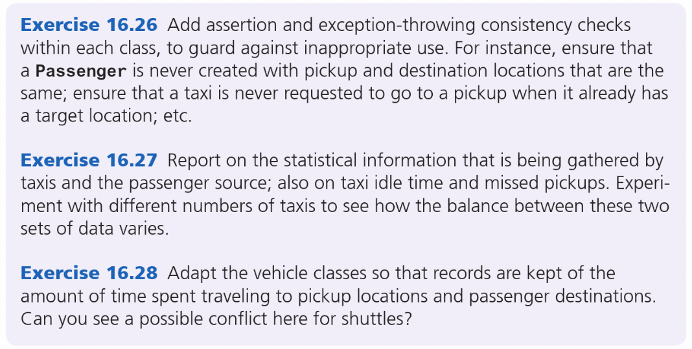

# CS112 4.4: T3 CW#1 - Summative Assessment (4%)

## Taxi Company Later Stage

### Group Members and Division of Work

| **Name**       | **Work Contribution** |
|----------------|-----------------------|
| Isaac Oxenham  | 16.26                 |
| Cameron Clancy | 16.27 & 26.28         |
| Stuart Barr    | 16.27 & 26.28         |
| Russel Wright  |                       |

